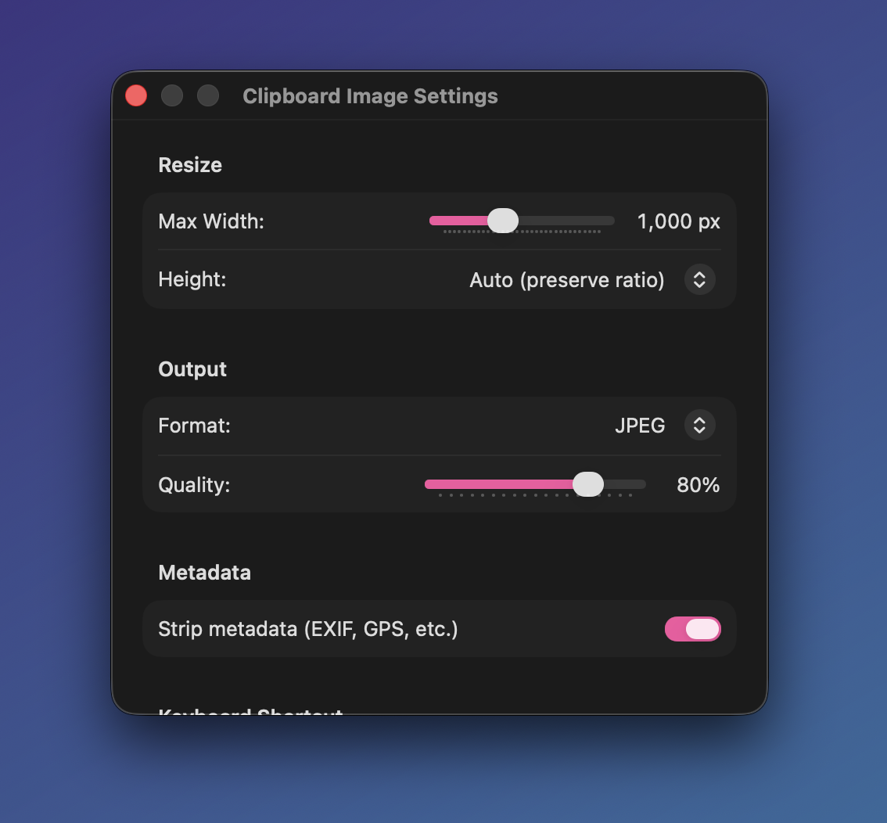

<p align="center">
  
</p>

<h1 align="center">ScreenShawty</h1>

<p align="center">
  <strong>The screenshot power tool for macOS.</strong><br>
  Control screenshot defaults and auto-shrink clipboard images — all from your menu bar.
</p>

<p align="center">
  
  
  
  
</p>

<p align="center">
  
</p>

---

## What it does

ScreenShawty lives in your menu bar and gives you instant control over macOS screenshot settings that are normally buried in Terminal commands. Plus, it can automatically shrink any image on your clipboard.

### Screenshot Controls

- **Save location** — Desktop, Downloads, Screenshots, Clipboard, or any custom folder
- **Format** — PNG, JPG, HEIC, PDF, TIFF, GIF
- **Window Shadow** — Toggle on/off
- **Floating Thumbnail** — Toggle the preview that appears after screenshotting
- **Include Date** — Toggle date in screenshot filenames

### Clipboard Image Shrinking

- **Shrink Clipboard Image** — Resize and compress whatever image is on your clipboard
- **Auto-Shrink** — Automatically shrink every image that hits your clipboard (great for pasting screenshots into chat or email)
- **Global shortcut** — `⌃⌥⌘S` to shrink from anywhere
- **Configurable** — Set max width/height, output format (PNG/JPEG/HEIC), quality, and metadata stripping

<p align="center">
  
</p>

## Install

### Download

Grab the latest `.dmg` from [**Releases**](https://github.com/dbreck/ScreenShawty/releases), open it, and drag ScreenShawty to Applications.

> ScreenShawty is signed with a Developer ID certificate and notarized by Apple for safe distribution outside the App Store.

### Build from source

```bash
git clone https://github.com/dbreck/ScreenShawty.git
cd ScreenShawty
xcodebuild -project ScreenShawty.xcodeproj -scheme ScreenShawty -configuration Release build
```

Requires Xcode 15+ and macOS 14.0+ (Sonoma).

## How it works

ScreenShawty reads and writes `com.apple.screencapture` defaults — the same system macOS uses internally. Changes take effect immediately.

| Setting | defaults key | Values |
|---------|-------------|--------|
| Save location | `location` | File path |
| Destination | `target` | `clipboard` or absent |
| Format | `type` | `png`, `jpg`, `heic`, `pdf`, `tiff`, `gif` |
| Shadow | `disable-shadow` | `true`/`false` |
| Thumbnail | `show-thumbnail` | `true`/`false` |
| Include date | `include-date` | `true`/`false` |

The clipboard shrinking feature works independently — it reads the current clipboard image, resizes/compresses it based on your settings, and replaces the clipboard contents. A notification confirms the result with before/after dimensions and file size reduction.

## Keyboard Shortcuts

| Shortcut | Action |
|----------|--------|
| `⌃⌥⌘S` | Shrink Clipboard Image |
| `⌘Q` | Quit ScreenShawty |

The shrink shortcut is customizable in Clipboard Settings.

## Tech

- SwiftUI with `MenuBarExtra` (`.menu` style)
- No dock icon (`LSUIElement = true`)
- [KeyboardShortcuts](https://github.com/sindresorhus/KeyboardShortcuts) for global hotkey
- Hardened Runtime, Developer ID signed, notarized

## License

[MIT](LICENSE)

---

<p align="center">
  Built by <a href="https://github.com/dbreck">@dbreck</a>
</p>
